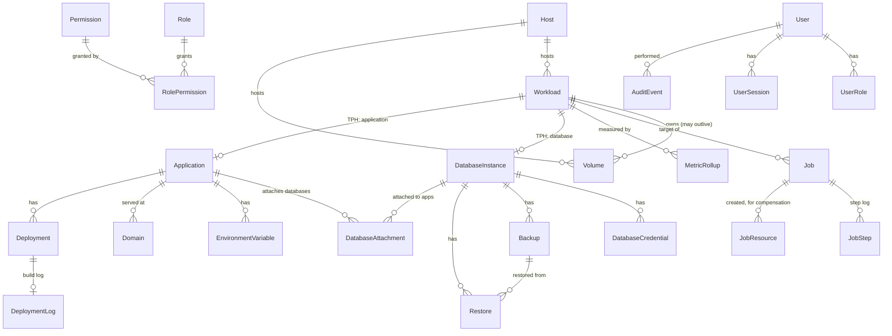

# Airside — Entity model

Status: **proposed, awaiting approval.** No implementation code exists yet.

Entities, relationships, key strategy, and the migration plan. This is the shape
the API contract (deliverable 5) will expose, so disagreements are cheaper here
than there.

Conventions from `CONVENTIONS.md` apply throughout and are not repeated per
entity: UUIDv7 primary keys, `DateTimeOffset` UTC via `TimeProvider`, `long` for
all resource figures, no `decimal`, application-managed `RowVersion`, one
`IEntityTypeConfiguration<T>` per entity, no mapping attributes.

---

## 1. Principles

**Six rules shape most of the decisions below.**

1. **Allocation must be a single query.** `SUM` over one table, filtered by host.
   Anything that forces a `UNION` to compute allocated capacity will eventually
   be computed wrong. This is the main reason `Workload` is one table.

2. **Allocated capacity is never stored.** It is derived from workload rows on
   every admission check. A cached counter drifts, and the allocation gate is the
   worst possible place for drift.

3. **Injected configuration is computed, never stored.** Connection details
   injected into an application come from the attachment plus the live
   credential, rendered at deploy time. Storing them as rows means a credential
   rotation silently leaves an application holding a dead password until someone
   notices.

4. **Audit and history denormalise.** Audit rows, backups, and deployments carry
   snapshots of the names and versions they refer to. A record that becomes
   unreadable once its subject is deleted is not a record.

5. **Compensation is data, not control flow.** Resources created by a job are
   rows. A process that dies mid-provision leaves a durable list of what to clean
   up, so recovery is a query rather than an archaeology exercise.

6. **A volume outlives its workload.** The brief requires that deleting a
   database leaves its data alone. That makes volume lifetime independent of
   workload lifetime, which drives several nullability and retention choices.

---

## 2. Overview

Roughly 30 tables. Grouped: host and capacity (1), identity and access (6),
workloads (4), storage and networking (2), applications (5), databases (4), jobs
(3), observability and system (5).

---

## 3. Host and capacity

### `Host`

One seeded row for the MVP. It exists from the first migration because
retrofitting a host dimension later means rewriting every allocation query and
every uniqueness constraint — which is the usual reason "multi-host later" never
happens.

| Column | Type | Notes |
|---|---|---|
| `Id` | uuid v7 | |
| `Name` | string(64) | display only |
| `IsLocal` | bool | true for the MVP row; false implies a future agent |
| `CapacityCpuNanos` | long | discovered |
| `CapacityMemoryBytes` | long | discovered |
| `CapacityStorageBytes` | long | discovered, volume root filesystem |
| `ReserveCpuNanos` | long | default 1 CPU |
| `ReserveMemoryBytes` | long | default 1 GiB |
| `ReserveStorageBytes` | long | default 10 GiB |
| `StorageEnforcement` | enum | `Accounting` \| `Quota` — see `ARCHITECTURE.md` §5 |
| `VolumeRoot` | string | allowlist root for bind mounts |
| `DockerApiVersion`, `KernelVersion`, `OperatingSystem` | string | diagnostics |
| `LastDiscoveredAt` | timestamptz | capacity is re-read on a timer |

Capacity is re-discovered rather than configured: an EC2 instance can be resized
under you, and a control plane that keeps admitting workloads against a
remembered 16 GB after a downgrade to 8 GB is worse than one that admits none.

**No `AllocatedX` columns.** Derived (principle 2).

---

## 4. Identity and access

### `User`

Built on ASP.NET Core Identity's user store — `AirsideUser : IdentityUser<Guid>`,
with `AirsideDbContext : IdentityUserContext<AirsideUser, Guid>`.

**Why Identity, and why only half of it.** Password hashing, security stamps,
lockout, email normalisation, TOTP two-factor, and recovery codes are exactly the
things the brief means by "don't hand-roll crypto", and reimplementing security
stamps correctly is a bad use of a first release. But Identity's *role* system is
string-based and coarse, and Airside needs permission-based policies.
`IdentityUserContext` (rather than `IdentityDbContext`) maps users, claims,
logins, and tokens **without** the role tables — so we get the security
machinery and none of the authorisation model we do not want.

Airside-specific additions: `DisplayName`, `IsActive`, `LastLoginAt`,
`CreatedByUserId`, `DeactivatedAt`.

`IdentityUserToken` carries the TOTP authenticator key and recovery codes, which
satisfies "architecture ready for MFA" without a schema change when MFA ships.

> The last active Super Admin cannot be deactivated or stripped of the role.
> Enforced at the service layer, since neither provider can express it as a
> constraint. Locking yourself out of a control plane with root-equivalent host
> reach is unrecoverable without SSH.

### `Role`, `Permission`, `RolePermission`, `UserRole`

`Role` — `Id`, `Slug` (unique), `Name`, `Description`, `IsSystem`. Six seeded
system roles: Super Admin, Infrastructure Admin, Database Admin, Application
Admin, Developer, Read Only. System roles cannot be deleted or renamed; their
permission sets are editable except Super Admin's.

`Permission` — **primary key is the code string**, not a uuid.
`database.create`, `database.query`, `secret.view`, `application.deploy`,
`server.manage`, `user.manage`, and so on. A natural key makes `RolePermission`
readable in a raw query and makes a permission check greppable.

The catalogue is defined in code and **synchronised into the table at startup**:
insert missing codes, mark absent ones `IsObsolete` (never delete — a
`RolePermission` FK may still point at it). So adding a permission is a code
constant plus a seeder run, not a migration on two providers.

`RolePermission` — (`RoleId`, `PermissionCode`) composite key.
`UserRole` — (`UserId`, `RoleId`) composite key. Users may hold several roles;
effective permissions are the union.

> **Known limitation, stated deliberately: permissions are global, not
> resource-scoped.** A user with `database.query` can query every database, not a
> chosen subset. Scoping is the single most likely follow-up request, and
> retrofitting it means touching every authorisation check — so it should be a
> conscious "not now" rather than an oversight. The migration shape when it comes
> is a nullable `ScopeWorkloadId` on `UserRole` plus a resource-aware requirement
> handler. I have not added the column, because an unused nullable column
> invariably gets misread as a working feature.

### `UserSession`

`Id`, `UserId`, `CreatedAt`, `ExpiresAt`, `LastSeenAt`, `IpAddress`,
`UserAgent`, `RevokedAt`, `RevokedReason`.

**Authentication is cookie-based, not JWT.** The dashboard is same-origin,
`EventSource` sends cookies on same-origin requests so the live streams need no
scheme of their own, and an `HttpOnly` `SameSite=Strict` cookie keeps the
credential out of JavaScript entirely. (This is also why SSE was viable at all:
`EventSource` cannot set an `Authorization` header, which is what usually rules
it out for bearer-token APIs.) JWTs would buy cross-origin and
machine-to-machine access, neither of which exists in the MVP — the CLI talks to
the Docker socket, not the API.

The table exists so sessions can be listed and revoked individually
("sign out other devices", "revoke on deactivation"), which cookie auth alone
cannot express. Security-stamp validation handles the password-change case.

> Deferred, not forgotten: **API tokens for CI/CD deploys.** `application.deploy`
> from a pipeline is a real need and does not fit cookie auth. It is a separate
> `ApiToken` entity and a second authentication scheme, and it belongs in a phase
> where deployment exists.

---

## 5. Workloads

### `Workload` — abstract, table-per-hierarchy

One table, discriminator `Kind` (`database` | `application`).

**Why TPH rather than two independent tables.** Allocation, jobs,
reconciliation, metrics, logs, drift detection, and audit all operate on "a
workload" uniformly. With separate tables, every one of those becomes a `UNION`,
and the first one somebody forgets to update is a resource accounting bug that
admits workloads the host cannot run. TPT would preserve the single query but
adds a join to every read for no benefit at this table count.

The cost is nullable subtype columns. There are about nine of them. That is a
better trade than a `UNION` in the allocation gate.

| Column | Type | Notes |
|---|---|---|
| `Id` | uuid v7 | also the `airside.workload-id` label value |
| `HostId` | uuid | |
| `Kind` | string | TPH discriminator |
| `Slug` | string(32) | unique per host among non-deleted |
| `DisplayName` | string(128) | free text, never used to build an identifier |
| `State` | string | see §9; valid set owned by the subtype |
| `StateChangedAt` | timestamptz | |
| `CpuLimitNanos` | long | → `HostConfig.NanoCPUs` |
| `MemoryLimitBytes` | long | → `HostConfig.Memory` |
| `StorageAllocationBytes` | long | accounted; enforced only where `Host.StorageEnforcement = Quota` |
| `AutoRestart` | bool | → restart policy |
| `ContainerId` | string? | current container; null while stopped or provisioning |
| `NetworkId`, `NetworkName` | string? | the workload's own network |
| `ActiveJobId` | uuid? | the per-workload lease (§8) |
| `LastReconciledAt` | timestamptz? | |
| `DriftState` | enum | `None` \| `Missing` \| `Unexpected` \| `Mismatched` |
| `CreatedByUserId` | uuid? | |
| `RowVersion`, `CreatedAt`, `UpdatedAt`, `DeletedAt` | | soft delete |

**Slug uniqueness is among non-deleted rows only**, so a slug can be reused after
a delete. Ambiguity in history is handled by audit, backup, and deployment rows
carrying a slug snapshot alongside the workload ID — the ID disambiguates, the
snapshot stays readable.

There is no `WorkloadNetwork` table. A workload's own network name is derived
from its slug and its Docker ID is a column; cross-workload network membership is
`DatabaseAttachment` (§7), which is the authorisation record anyway. A separate
table would duplicate both.

### `DatabaseInstance : Workload`

| Column | Type | Notes |
|---|---|---|
| `Engine` | enum | `Postgres` \| `MySql` \| `MongoDb` \| `Redis` |
| `Version` | string | e.g. `16`, `8.0`, `7` |
| `ImageRef` | string | resolved image |
| `ImageDigest` | string | pinned at provision; a tag is not a version |
| `DatabaseName` | string? | **null for Redis** |
| `PublishedPort` | int? | null means not published |
| `PublishBindAddress` | string | **defaults to `127.0.0.1`** |
| `BackupEnabled` | bool | Redis cache instances legitimately set false |
| `BackupCron` | string? | |
| `BackupRetentionCount` | int? | |
| `BackupRetentionDays` | int? | |
| `MaxMemoryBytes` | long? | **Redis only**, required when engine is Redis |
| `MaxMemoryPolicy` | string? | **Redis only**, required when engine is Redis |
| `AofEnabled` | bool? | **Redis only** |

`ImageDigest` is pinned deliberately. `postgres:16` moves; a restart six months
later silently landing on a new patch release is how a database comes back
refusing to start. Upgrades are explicit.

Engine-specific fields are explicit nullable columns rather than a JSON blob:
five columns, typed, queryable, and validated per engine by the capability
lookup. A polymorphic owned-JSON column would be typed in C# and opaque to every
query, for no saving.

### `Application : Workload`

| Column | Type | Notes |
|---|---|---|
| `SourceKind` | enum | `Image` \| `Git` \| `Dockerfile` |
| `ImageRef` | string? | `Image` source |
| `RegistryCredentialId` | uuid? | private registries |
| `GitRepositoryUrl` | string? | `Git` source |
| `GitBranch` | string? | |
| `GitCredentialId` | uuid? | private repos |
| `DockerfilePath` | string? | relative to repo root; validated against traversal |
| `BuildContextPath` | string? | |
| `DockerfileContent` | text? | `Dockerfile` source |
| `ContainerPort` | int | the port the app listens on — the Caddy upstream |
| `HealthCheckKind` | enum | `Http` \| `Command` — **no `None`** |
| `HealthCheckPath` | string? | |
| `HealthCheckExpectedStatus` | int? | |
| `HealthCheckCommand` | string[]? | argv, never a command line |
| `HealthCheckIntervalSeconds`, `HealthCheckTimeoutSeconds`, `HealthCheckRetries` | int | |
| `CurrentDeploymentId` | uuid? | |

`HealthCheckKind` has no `None` member. Zero-downtime deployment is defined as
"start the new container, poll its health check, move the upstream, stop the
old" — without a health check that reduces to waiting a few seconds and hoping,
and calling that zero-downtime is a lie the data model should not make
expressible. `Docker Compose` is not a source kind (out of MVP scope).

---

## 6. Storage

### `Volume`

| Column | Type | Notes |
|---|---|---|
| `Id`, `HostId` | uuid | |
| `WorkloadId` | uuid | **not null**, and not cascade-deleted |
| `Name` | string | `airside-vol-<slug>-<purpose>` |
| `MountPath` | string | inside the container |
| `Purpose` | enum | `Data` \| `Backup` \| `Config` |
| `SizeAllocationBytes` | long | counts against host capacity |
| `LastMeasuredBytes` | long? | null until first measurement |
| `MeasuredAt` | timestamptz? | |
| `OrphanedAt` | timestamptz? | set when the owning workload is deleted and the volume kept |
| `DeletedAt` | timestamptz? | |

`WorkloadId` stays non-null and points at a soft-deleted workload after an
orphaning delete. That is what lets the reclaim screen say *"12 GB, formerly the
`orders` Postgres, orphaned 14 March"* instead of showing an anonymous volume
nobody dares remove.

Orphaned volumes keep counting against allocated storage. Otherwise a few
delete-and-recreate cycles quietly consume the disk with nothing in the UI
explaining where it went.

---

## 7. Attachment, environment, domains

### `DatabaseAttachment`

The single record that means "this application may reach this database". It is
simultaneously the network authorisation, the credential selection, and the
environment injection source.

| Column | Type | Notes |
|---|---|---|
| `Id` | uuid v7 | |
| `ApplicationId`, `DatabaseInstanceId` | uuid | |
| `EnvKeyPrefix` | string(32) | default per engine: `DATABASE`, `DATABASE`, `MONGO`, `REDIS` |
| `CredentialId` | uuid | which `DatabaseCredential` is injected |
| `AttachedAt`, `AttachedByUserId` | | |
| `DetachedAt`, `DetachedByUserId` | | |

Unique among active rows on (`ApplicationId`, `DatabaseInstanceId`) and on
(`ApplicationId`, `EnvKeyPrefix`) — the second is what stops two attached
Postgres databases fighting over `DATABASE_URL`.

Attaching joins the application container to the database's network; detaching
removes it. Detach is a soft close (`DetachedAt`), not a delete, because the
audit trail for "who gave this app access to the customer database" must survive.

### `EnvironmentVariable`

| Column | Type | Notes |
|---|---|---|
| `Id`, `ApplicationId` | uuid | |
| `Key` | string(128) | unique per application; rejected if it collides with an active attachment prefix |
| `Value` | text | Data Protection ciphertext when `IsSecret` |
| `IsSecret` | bool | |
| `UpdatedByUserId`, `CreatedAt`, `UpdatedAt` | | |

**Only manually-entered variables are rows.** Attachment-injected keys
(`DATABASE_URL`, `REDIS_PASSWORD`, …) are rendered at deploy time from the
attachment and the live credential, and are never persisted here. Storing them
would mean a credential rotation leaves stale rows that quietly break the
application on its next restart — with the UI showing the new password and the
container holding the old one. The API exposes a merged, masked "effective
environment" view so the admin still sees everything in one place.

`Value` holds ciphertext or plaintext depending on `IsSecret`; Data Protection
payloads carry their own key identifier, so no separate key-version column is
needed. Secrets are masked in every response by default and revealed only through
an explicitly permissioned endpoint that writes an audit row.

### `Domain`

`Id`, `ApplicationId`, `Hostname` (globally unique among active), `IsPrimary`,
`State` (`Pending` | `Active` | `Failed`), `CaddyRouteId`,
`CertificateIssuer`, `CertificateNotBefore`, `CertificateNotAfter`,
`CertificateAutoRenew`, `LastCertificateCheckAt`, `CreatedAt`, `DeletedAt`.

Certificate fields are a cache of what Caddy reports, refreshed on a timer. Caddy
is the source of truth; this table exists so the UI can render issuer and expiry
without a proxy round-trip, and so the expiry notification has something to
compare against.

---

## 8. Databases: credentials, backups, restores

### `DatabaseCredential`

`Id`, `DatabaseInstanceId`, `Username` (**null for Redis** — `requirepass`
authenticates the implicit `default` user), `EncryptedPassword`, `IsPrimary`,
`State` (`Active` | `Retired` | `Revoked`), `CreatedAt`, `RetiredAt`,
`RotatedByUserId`.

A table rather than two columns on the instance so the record of who rotated what
and when survives, and so Redis 6+ ACL users drop in later as additional rows
rather than as a schema change.

> **Correction.** An earlier version of this document claimed the table provided
> two live credentials at once, with a rotate → redeploy → revoke window. It does
> not, and testing against a live Postgres proved it: each engine stores one
> password per role, so rotation replaces it and the old value is rejected
> immediately. Rotation is therefore a breaking change for anything connected.
> Real overlap requires issuing a *second role* with matching grants, which is a
> separate feature rather than a state on this row.

### `Backup`

| Column | Type | Notes |
|---|---|---|
| `Id`, `DatabaseInstanceId`, `JobId` | uuid | |
| `Kind` | enum | `Logical` (pg_dump/mysqldump/mongodump) \| `Snapshot` (Redis RDB) |
| `TriggerKind` | enum | `Scheduled` \| `Manual` \| `PreRestore` \| `PreUpdate` |
| `Status` | enum | `Running` \| `Succeeded` \| `Failed` |
| `StoragePath` | string | under the managed volume root |
| `SizeBytes` | long? | |
| `Sha256` | string? | verified before any restore |
| `EngineSnapshot` | string | e.g. `postgres:16.4` |
| `DatabaseNameSnapshot` | string? | |
| `StartedAt`, `CompletedAt`, `ExpiresAt` | | |
| `IsRetained` | bool | pins against retention pruning |
| `CreatedByUserId` | uuid? | |

`EngineSnapshot` is not decoration. A `pg_dump` from 16 does not restore into 15,
and a restore that discovers this halfway through has already stopped the
database. The restore flow refuses on a version mismatch rather than trying.

`Sha256` is verified before restore — a truncated backup that restores as an
empty database is the worst possible failure mode for this feature.

### `Restore`

`Id`, `DatabaseInstanceId`, `BackupId`, `JobId`, `PreRestoreBackupId`, `Status`,
`StartedAt`, `CompletedAt`, `RequestedByUserId`, `ErrorCode`, `ErrorMessage`.

A restore always takes a `PreRestore` backup first and links it, so the answer to
"we restored the wrong backup" is a row rather than a conversation. Restores are
a mandatory audit event.

---

## 9. Jobs

### `Job`

| Column | Type | Notes |
|---|---|---|
| `Id` | uuid v7 | returned by every `202` |
| `Type` | string | `database.provision`, `application.deploy`, … |
| `HostId` | uuid | |
| `WorkloadId` | uuid? | null for system jobs |
| `Status` | enum | `Queued` \| `Running` \| `Succeeded` \| `Failed` \| `Cancelled` \| `Compensating` \| `Compensated` |
| `ProgressPercent` | int | |
| `CurrentStep` | string? | |
| `Payload` | json | typed per job type, via `ToJson()` |
| `IdempotencyKey` | string | unique; `<type>:<workloadId>` for provisioning |
| `AttemptCount` | int | |
| `LeaseOwner`, `LeaseExpiresAt` | | detects a dispatcher that died mid-job |
| `ErrorCode`, `ErrorMessage`, `ErrorDetail` | | `ErrorCode` matches the API error code |
| `QueuedAt`, `StartedAt`, `CompletedAt` | | |
| `TriggeredByUserId` | uuid? | |

Jobs are persisted rows precisely because the channel is not durable and
self-update restarts the API by design (`ARCHITECTURE.md` §6). On startup, jobs
left `Running` with an expired lease are either resumed — handlers are idempotent
by `IdempotencyKey` — or moved to `Compensating`.

**Per-workload serialisation** is `Workload.ActiveJobId` guarded by `RowVersion`.
A second job for the same workload stays `Queued` and runs after, rather than
failing: a resize landing during a backup would corrupt both.

### `JobStep`

`Id`, `JobId`, `Sequence`, `Name`, `Status`, `StartedAt`, `CompletedAt`,
`Message`. Append-only; this is the step log the brief requires and what SignalR
replays to a client that connects late.

Verbose output — build logs, `pg_dump` stderr — does **not** go here. It streams
live and, where it is worth keeping, lands in `DeploymentLog`. A
job table carrying megabytes of container output makes every job list query slow.

### `JobResource`

`Id`, `JobId`, `Kind` (`Container` | `Volume` | `Network` | `Image` |
`ProxyRoute`), `Reference`, `CreatedByThisJob` (bool), `CompensatedAt`.

This is how "a failed deployment must not leave an orphaned container, volume,
network, or proxy route" becomes mechanical. Each resource is written here as it
is created; compensation walks the rows in reverse. `CreatedByThisJob` is what
stops a retry from deleting a volume that existed beforehand.

Because the rows are durable, a job whose process is killed outright is still
recoverable — the startup sweep has an exact list.

---

## 10. Deployments

### `Deployment`

`Id`, `ApplicationId`, `Number` (monotonic per application — humans say
"deployment 14"), `Status`, `TriggerKind` (`Manual` | `Rollback` | `Api`),
`SourceKindSnapshot`, `CommitSha`, `CommitMessage`, `Branch`, `ImageRef`,
`ImageDigest`, `ContainerId`, `JobId`, `StartedAt`, `CompletedAt`, `DurationMs`,
`IsCurrent`, `RolledBackFromDeploymentId`, `TriggeredByUserId`,
`ErrorCode`, `ErrorMessage`.

`ImageDigest` is what makes rollback a container start rather than a rebuild — a
tag can be overwritten, a digest cannot. Retention of previous images is bounded
by a configurable count; the retention policy must never prune the image
belonging to `IsCurrent` or to the immediately previous successful deployment.

### `DeploymentLog`

`DeploymentId` (PK, 1:1), `Content` (text), `TruncatedAt`, `ByteCount`.

Separate table so listing deployments never loads build output. Capped, with the
head and tail retained on overflow — the useful parts of a failed build are the
first error and the last line, not the middle.

---

## 11. Audit, observability, system

### `AuditEvent`

| Column | Type | Notes |
|---|---|---|
| `Id` | uuid v7 | |
| `OccurredAt` | timestamptz | |
| `UserId` | uuid? | null for system-initiated |
| `UserEmailSnapshot` | string? | denormalised on purpose |
| `Action` | string | `database.delete`, `secret.reveal`, … |
| `ResourceKind`, `ResourceId` | | |
| `ResourceSlugSnapshot` | string? | |
| `Result` | enum | `Success` \| `Failure` \| `Denied` |
| `IpAddress`, `UserAgent` | | |
| `CorrelationId` | string | joins to logs and to the job |
| `Metadata` | json | never contains a secret value |

The snapshots exist because an audit record must stay readable after the user and
the resource are gone — which is exactly the case an audit log is for.

Append-only is enforced three ways: no update or delete path in code, no such
endpoint, and a database-level guard in the provider-specific migration —
`REVOKE UPDATE, DELETE` on Postgres, a `BEFORE UPDATE … RAISE(FAIL)` trigger on
SQLite.

Mandatory events, per the brief: deletions, restores, credential rotation, secret
access, permission changes, deployments, resizes. Denied authorisation attempts
are recorded too, since a failed `secret.reveal` is more interesting than a
successful one.

### `MetricRollup`

`WorkloadId`, `HourUtc` (composite key), `CpuNanosAvg`, `CpuNanosMax`,
`MemoryBytesAvg`, `MemoryBytesMax`, `SampleCount`.

> **Recommendation: store hourly rollups only. Live data is never persisted.**
> Minute-resolution samples for 20 workloads across two metrics is roughly 57,000
> rows a day, which Postgres shrugs at and SQLite accumulates unpleasantly over
> months without disciplined pruning that nobody will write. Live charts stream
> from the Docker stats API over SignalR and stay in a bounded in-memory ring
> buffer. Rollups give useful trend history at ~480 rows a day.
>
> The cost is real and worth stating: you cannot retrospectively examine a
> two-minute CPU spike from last Tuesday. For a single-host control plane where
> the alternative is operating a time-series database, I think that is the right
> trade — but it is a product decision, not a technical one.

### `Notification`

`Id`, `Kind`, `Severity`, `Title`, `Body`, `ResourceKind`, `ResourceId`,
`DedupeKey`, `CreatedAt`, `ReadAt`, `ResolvedAt`.

`DedupeKey` is unique among unresolved rows. Without it, a certificate-expiry
check running hourly produces one notification per hour for thirty days, and the
feature becomes something admins turn off.

### `InstanceSettings`

Singleton row: `InstanceName`, `DashboardDomain`, `StoreProvider`
(`Postgres` | `Sqlite`), `CurrentImageTag`, `PreviousImageTag`, `UpdateChannel`,
`SetupCompletedAt`, `SetupTokenHash`, `SetupTokenExpiresAt`, `TelemetryEnabled`.

`SetupTokenHash` is the first-run flow: the installer prints a one-time token, the
hash lands here, and the first request must present it. Only a hash is stored, so
a database dump does not hand over first-run access.

### `UpdateRecord`

`Id`, `FromVersion`, `ToVersion`, `Status`, `StartedAt`, `CompletedAt`,
`SystemBackupPath`, `MigrationApplied` (bool), `RolledBack`, `ErrorMessage`.

Mirrors the durable `state.json` the updater and CLI use, so the UI can show
update history. `MigrationApplied` matters for rollback — see §13.

### `GitCredential`, `RegistryCredential`

`Id`, `Name`, `Kind` (`SshKey` | `Token` | `UserPass`), `EncryptedSecret`,
`CreatedAt`, `CreatedByUserId`, `LastUsedAt`. Encrypted via Data Protection,
never returned in any response, referenced by `Application`. Phase 4.

### `SavedQuery`, `QueryHistoryEntry`

`SavedQuery` — `Id`, `UserId`, `DatabaseInstanceId?`, `Name`, `Body`,
`CreatedAt`, `UpdatedAt`.

`QueryHistoryEntry` — `Id`, `UserId`, `DatabaseInstanceId`, `Body`, `ExecutedAt`,
`DurationMs`, `RowsAffected`, `Success`, `ErrorMessage`.

> **Query history is a secret-leak surface.** `INSERT INTO users (email, password)
> VALUES (…)` typed into the console lands in this table as plain text. So:
> history is strictly per-user and never shared or listable by another user
> regardless of permission, it is capped at the most recent N entries per user per
> database and pruned on write, and it is excluded from support bundles. Saved
> queries may be shared; history may not.

---

## 12. State machines

Both sets are persisted as strings in `Workload.State`. The valid set and the
legal transitions are owned by the subtype, checked in one place, and covered by
tests — an invalid transition is a `409`, never a silent write.

**Database:** `Provisioning → Running | Failed`; `Running ↔ Stopped`;
`Running → Restarting | BackingUp | Restoring | Deleting`;
`BackingUp | Restoring → Running | Failed`; `Failed → Deleting | Provisioning`;
`Deleting → Deleted`.

**Application:** `Created → Building`; `Building → Deploying | Failed`;
`Deploying → Running | Failed`; `Running ↔ Stopped`; `Running → Unhealthy`;
`Unhealthy → Running | Failed`; `Running → Building` (redeploy);
`Running | Failed → RollingBack`; `RollingBack → Running | Failed`;
`* → Deleting → Deleted`.

`BackingUp` is a state rather than a flag because a backup blocks a resize, and
the blocking rule is much easier to get right when it is a transition table
instead of scattered conditionals.

---

## 13. Migration plan

**One migration per phase, generated for both providers in the same pull
request.** CI runs `dotnet ef migrations has-pending-model-changes` against each
and fails if either is behind, because a migration that lands for Postgres and
not SQLite breaks the SQLite install and nothing else will catch it.

| Migration | Phase | Contents |
|---|---|---|
| `0001_Foundation` | 1 | `Host`, Identity user tables, `Role`, `Permission`, `RolePermission`, `UserRole`, `UserSession`, `Job`, `JobStep`, `JobResource`, `AuditEvent` (+ append-only guard), `InstanceSettings` |
| `0002_Databases` | 2 | `Workload` (+ TPH subtype columns), `Volume`, `DatabaseCredential` |
| `0003_DatabaseOps` | 3 | `Backup`, `Restore`, `SavedQuery`, `QueryHistoryEntry` |
| `0004_Applications` | 4 | `Deployment`, `DeploymentLog`, `EnvironmentVariable`, `DatabaseAttachment`, `GitCredential`, `RegistryCredential` |
| `0005_Networking` | 5 | `Domain` |
| `0006_Operations` | 6 | `MetricRollup`, `Notification`, `UpdateRecord` |

The `Workload` table lands in phase 2 rather than phase 1 because phase 1 has no
workloads to store — the container runtime abstraction and job system are
exercised against system containers and fakes.

### Seeding

**Seeding runs as an idempotent startup step, not through `HasData`.**
`HasData` bakes values into migration files, needs fixed timestamps that cannot
come from `TimeProvider`, and produces a diff on both providers every time a
seeded value changes. The startup seeder instead:

1. Synchronises the permission catalogue from code — insert missing, mark absent
   ones obsolete, never delete.
2. Ensures the six system roles and their permission sets exist.
3. Ensures the single `Host` row exists and refreshes its discovered capacity.
4. Ensures the `InstanceSettings` singleton exists.

It never creates a user. The first Super Admin is created through the first-run
flow, gated by the setup token, so a default credential never exists — not even
briefly.

### Applying migrations

Migrations run at API startup, before the app serves traffic. A failed migration
means the health check never passes, which is what triggers the updater's
rollback.

> **The API's own update is stop-then-start, not blue/green.** Two API containers
> sharing one store, both running `Migrate()`, is a corrupted schema — EF Core
> migrations are not concurrency-safe, and adding an advisory lock means
> provider-specific locking on a store that may be SQLite. A few seconds of
> control-plane downtime during a self-update is acceptable; user workloads are
> untouched and keep serving throughout. Blue/green stays where it belongs: user
> applications.

> **Migrations must be backward-compatible within a release — expand, then
> contract.** If version N+1 drops a column and its health check fails, the
> updater restores the N image against an N+1 schema, and old code meets a
> missing column. Rollback then requires restoring the pre-update dump, which
> means losing every write since the update started. So: additive changes only in
> any single release. Destructive changes split across two — N+1 stops using the
> column, N+2 drops it. `UpdateRecord.MigrationApplied` records when this was not
> possible, so the updater knows a database restore is required rather than just
> an image swap.
>
> This rule is recorded in `CONVENTIONS.md` §6.

---

## 14. Deliberate omissions

Named so they read as decisions rather than gaps:

- **No resource-scoped permissions** (§4). Global only; the retrofit shape is
  documented.
- **No API tokens** (§4). Cookie sessions only until CI/CD deploys are built.
- **No `Compose` source kind** (§5). Out of MVP scope.
- **No stored allocated-capacity counters** (§1). Derived every time.
- **No stored injected environment variables** (§7). Rendered at deploy.
- **No minute-resolution metric history** (§11). Hourly rollups plus a live
  stream.
- **No `AllocationReservation` table.** Admission is a semaphore plus a
  transaction on a single instance. Multi-host needs a real reservation record and
  a row lock, which is a Postgres-only prerequisite already noted in
  `ARCHITECTURE.md` §3.

---

## 15. Open questions

1. **Metric retention** (§11) — confirm hourly rollups are sufficient, or say
   what history you want and I will size the table properly.
2. **Slug reuse after delete** (§5) — currently allowed, with history kept
   unambiguous by ID plus snapshot. The alternative is permanent reservation,
   which is safer for audit clarity and mildly irritating in daily use.
3. **`Backup.StoragePath` is local disk only.** Off-host backup targets (S3) are
   the obvious next request and would add a `BackupTarget` entity. Worth
   confirming it is out of MVP scope, given that a backup living on the same
   instance as the database does not survive the failure people fear most.
